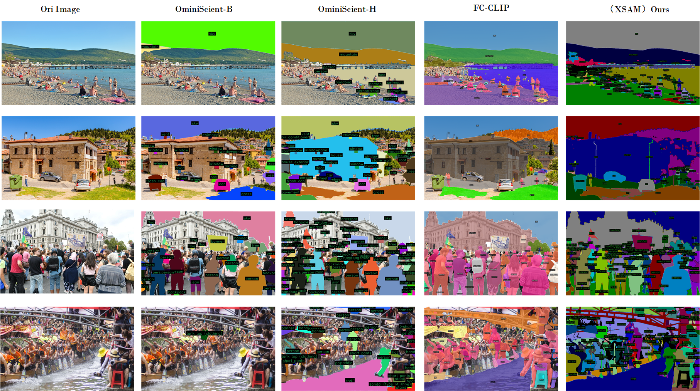
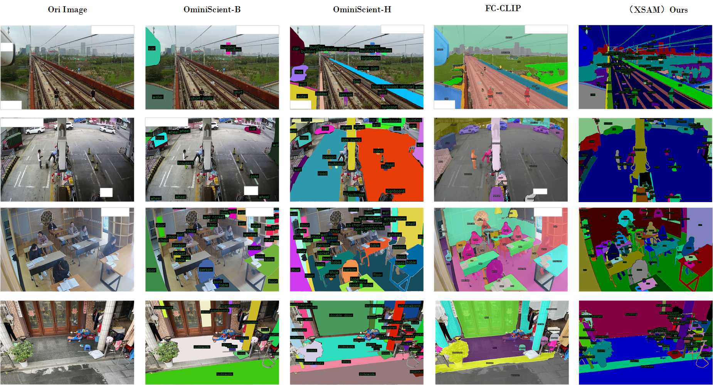
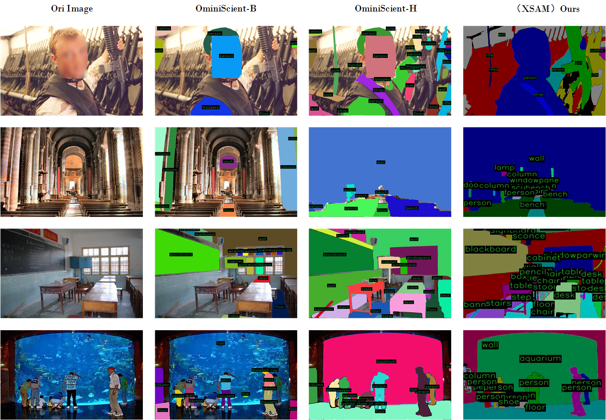
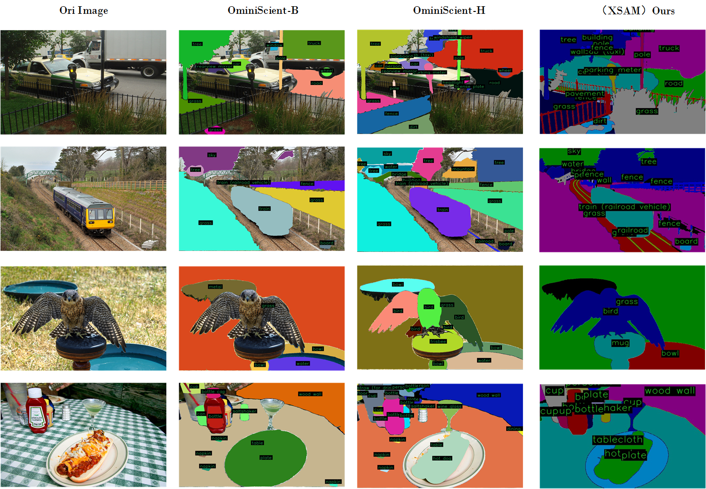

<!--# [XSAM : enhancing Open-Set Segmentation with Large Language Models](https://arxiv.org/abs/xxxxxx) -->

English 

<h2 align="center">
  XSAM : enhancing Open-Set Segmentation with Large Language Models
</h2>

**SA_1B dataset Result**

**Custom dataset Result**

**ADE20K dataset Result**

**Cityscapes dataset Result**

**COCO dataset Result**

[X] Demo and Api will be soon!

